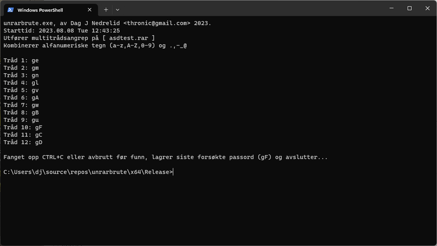
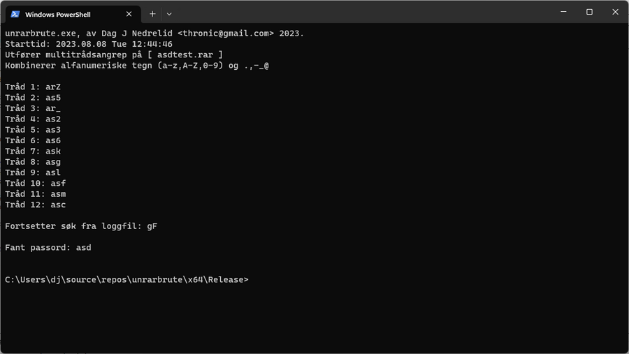

## unrarbrute

Et enkelt CLI verktøy for å bruteforce passordbeskyttede RAR filarkiv.  

  

  

Oppdatert 6.9.23 til å bruke unrar64.dll som er en del raskere, i stedet for eksterne kall mot unrar.exe  

På en maskin med i5-11400F (6 kjerner, 12 utnyttede tråder), finne passordet 'asd' via bruteforce a-z,A-Z,0-9 og .,-_@ på et RAR arkiv:  

Kall mot unrar.exe = 4 minutter og 15 sekunder.  
Kall mot unrar.dll = 2 minutter og 5 sekunder.
